# 🏫 MarkMyDay — School & College Management System

   
  <strong>Your School, Managed Simply.</strong>
  
A modern, automated, and role-based educational ERP application built for administrators, teachers, and students.

---

## 📖 Overview

**MarkMyDay** is a comprehensive school and college management system built natively for Android using **Kotlin** and **Jetpack Compose**. It aims to digitize educational environments by offering real-time role-based access, automated dynamic timetable generation, ML-powered QR attendance tracking, bulk data importing/exporting, and interactive digital classrooms.

The app uses **Google Firebase** (Authentication, Cloud Firestore, Cloud Messaging) as its backend framework to ensure real-time responsiveness, seamless notification synchronization, and enterprise-grade data security.

---

## 👥 User Roles & Features

The app is divided into three distinct roles, each tailored to specific requirements:

### 1. 🔑 Administrators (Admissions & Operations)
* **Admissions Portal**: Complete CRUD control over students and staff lists (add, search, update, delete).
* **Timetable Generator**: An advanced algorithmic scheduling tool that automatically compiles weekly timetables, checking and preventing conflicts across the school.
* **Leave Management**: Review and approve/reject leave requests submitted by teachers and students in real-time.
* **Announcements**: Write notices and broadcast global school updates with push notification support.
* **Academic Insights**: View statistics and logs of teacher and student attendance.

### 2. 👩‍🏫 Teachers (Faculty Portal)
* **Attendance Management**: Mark student attendance, view analytics, and export student attendance logs to Excel spreadsheets (`.xlsx`).
* **Gate QR Check-in**: Scan school gate QR codes (e.g., `MARK_MY_DAY_GATE_01`) using the camera to automatically log daily check-ins.
* **Digital Diary**: Post daily updates about what was taught in class along with homework for the next day.
* **Course & Quiz Manager**: Bulk-upload course videos (YouTube links) and quiz questions via CSV or Excel sheets.
* **Leave Request**: Submit leave applications and track approval statuses.

### 3. 🎓 Students (Learning Adventure)
* **Personal Dashboard**: View daily schedules, upcoming assignments, and direct notice broadcasts.
* **Attendance Tracker**: View overall and subject-specific attendance statistics.
* **Interactive Quizzes**: Take quizzes uploaded by teachers with auto-scoring and interactive feedback.
* **E-Learning Center**: Browse video courses, watch lecture recordings inside the app, and download course materials.
* **Timetable Grid**: View structured class grids featuring subject timing, period numbers, and teacher assignments.
* **Digital Diary**: Access homework assignments and classroom logs updated by teachers.
* **Competitive Leaderboard**: Track academic quiz achievements and class standings.

---

## 🌐 Dynamic Localization Feature

MarkMyDay features complete, end-to-end **Multi-Language Support (Localization)** to bridge communication gaps in diverse communities. Users can seamlessly switch between **English, Telugu (తెలుగు), Hindi (हिन्दी), and Punjabi (ਪੰਜਾਬੀ)** directly from the Settings panel. 

The localization system dynamically updates:
* **UI Text & Labels**: All dashboard elements, settings options, and form labels adapt to the selected language.
* **Real-time Re-rendering**: Leveraging Jetpack Compose state tracking, changing language triggers instant, smooth UI re-renders without requiring an app restart.
* **Date & Calendar Localization**: Adapts date pickers and calendars to reflect localized formats.

---

## 🛠️ Technology Stack

| Component | Technology | Description |
|---|---|---|
| **Language** | Kotlin | Built entirely on modern native Android patterns. |
| **UI Framework** | Jetpack Compose | Material Design 3 components, animations, and fluid transitions. |
| **Backend Database** | Firebase Cloud Firestore | Document-oriented real-time data synchronization. |
| **Authentication** | Firebase Auth | Secure login and role management. |
| **Push Notifications** | Firebase Cloud Messaging (FCM) | Real-time broadcast and personalized push alerts. |
| **Network Client** | Retrofit | Fetches global educational headlines, GK, and CBSE/SSC news. |
| **Hardware / ML** | CameraX & Google ML Kit | Scanning QR codes at gate terminals with sub-second decoding. |
| **File Processing** | Apache POI | Reads and writes CSV/Excel spreadsheets for data imports/exports. |
| **Preferences** | SharedPreferences | Local persistence for user settings, dark mode, and languages. |
| **Jetpack Libraries** | ViewModel, Navigation, Splash Screen | Standardized app architectures and clean startup experiences. |

---

## ⚙️ Core Architecture & Algorithms

### 📅 Backtracking Timetable Generator Algorithm
The app implements a dynamic **Constraint-Satisfaction Backtracking Algorithm** to automatically schedule classes based on weekly subject quotas:
1. **Quota Analysis**: Dynamically calculates required periods based on class category (Primary: 7 periods/day; Secondary/High School: 10 periods/day).
2. **Conflict Prevention (Heuristic-Driven)**:
   * **Teacher Availability**: Ensures teachers are not double-booked across different classes.
   * **Distribution Cap**: Limits a subject to a maximum of 3 occurrences per day.
   * **Fatigue Management**: Prevents more than 2 consecutive periods of the same subject.
   * **Leisure Planning**: Inserts automated free periods based on schedule quotas.

### 🔍 QR-Based Gate Attendance
Teachers scan a terminal QR code (`MARK_MY_DAY_GATE_01`) at the gate. The app leverages **Google ML Kit Barcode Scanning** to authenticate the terminal, fetch the user profile, verify credentials, and write an entry into Firestore under the `attendance_logs` sub-collection for the current date.

### 📥 Bulk File Parsers & Exporters
* **Import**: Teachers can import lists of questions or class video paths via `.csv` or `.xlsx` files using a custom robust token/CSV parser.
* **Export**: Excel generator creates spreadsheets summarizing daily attendance stats, formatting columns, and invoking Android's `FileProvider` to share reports.

---

## 📸 App Screenshots

### 🖥️ Role Dashboards
| Admin Dashboard | Teacher Dashboard & QR Check-in | Student Dashboard |
|:---:|:---:|:---:|
| 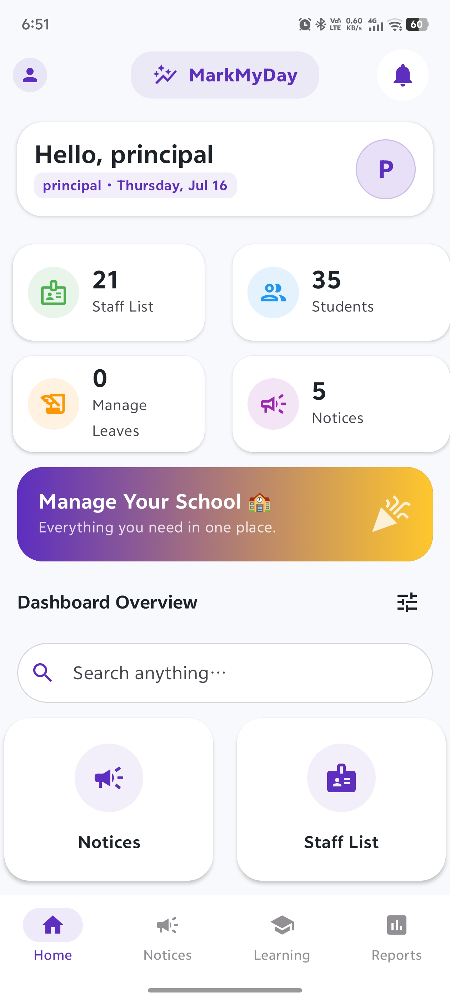 | 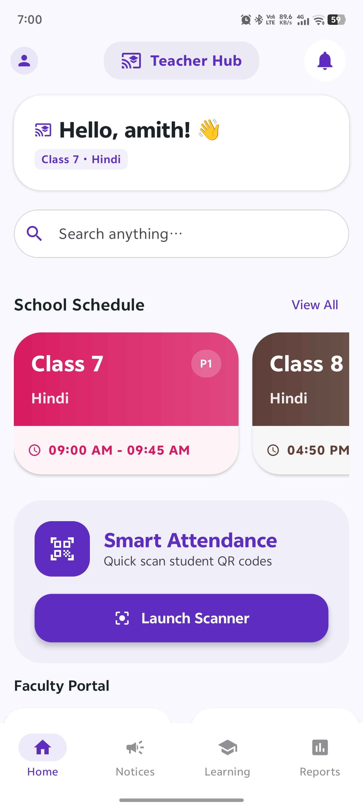 | 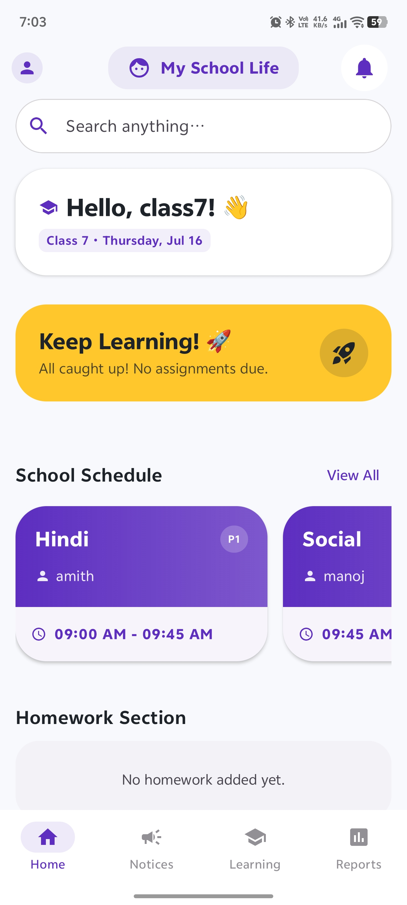 |

### 📅 Timetable Generation & Scheduling Flow
The weekly timetable is auto-generated through a 3-step setup and instantly displayed in a grid layout:

  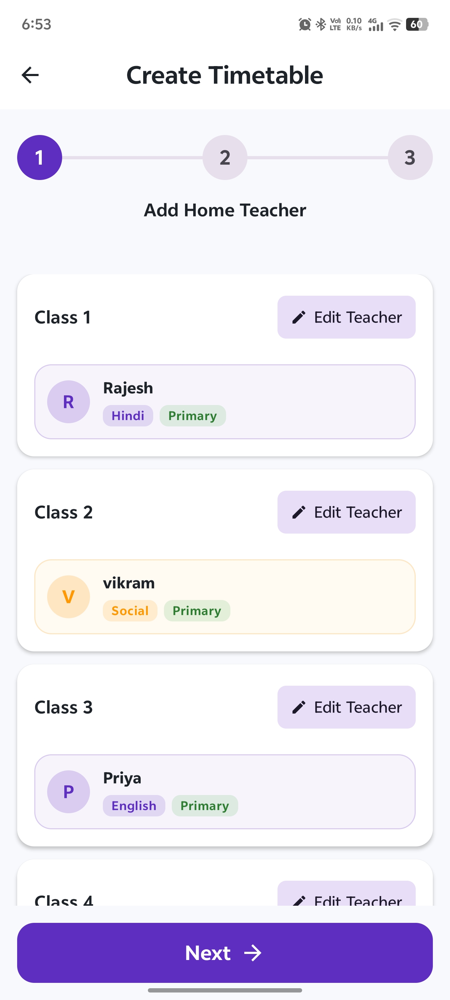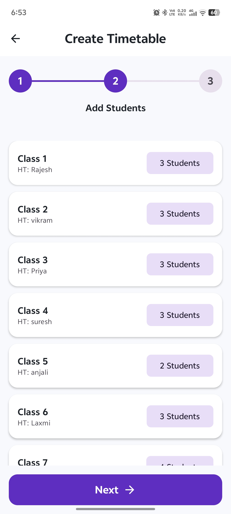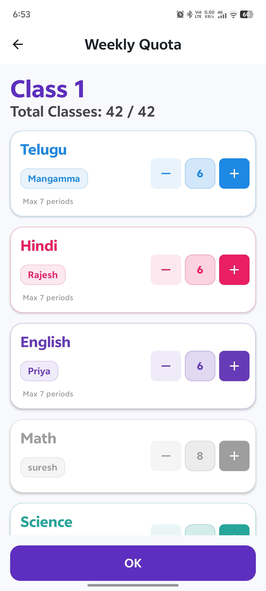

 

| Weekly Timetable Grid View |
|:---:|
| 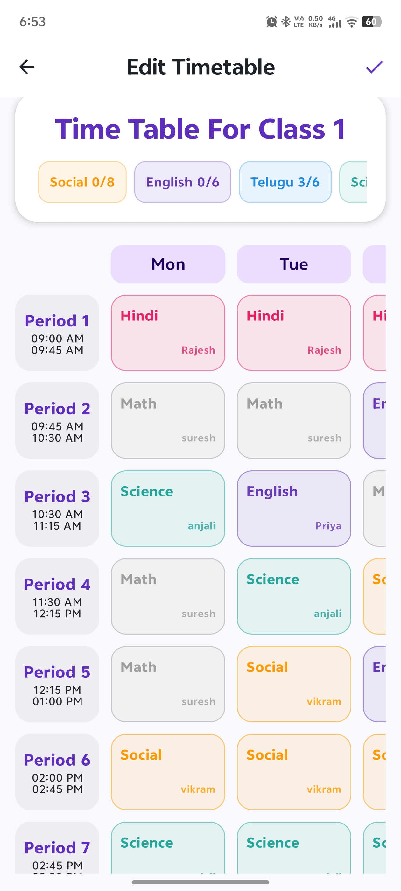 |

### 📚 Learning & Evaluation Portal
| E-Learning Upload Manager | Course Video Player | Quiz Interface (Active) |
|:---:|:---:|:---:|
| 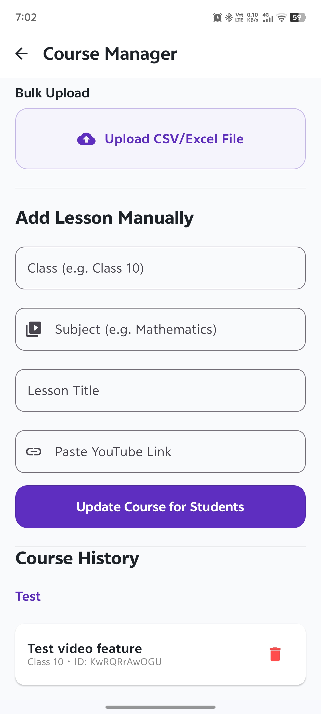 | 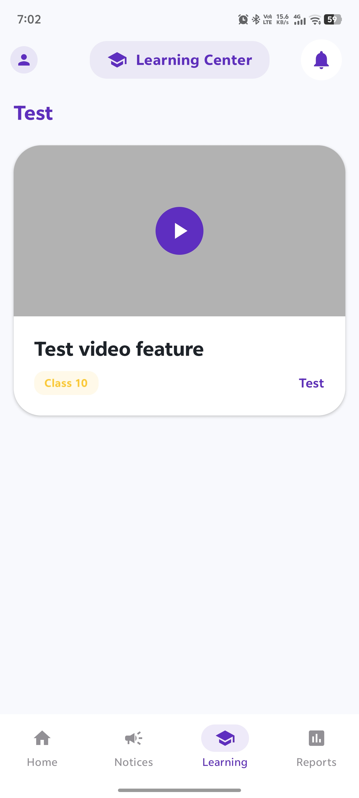 | 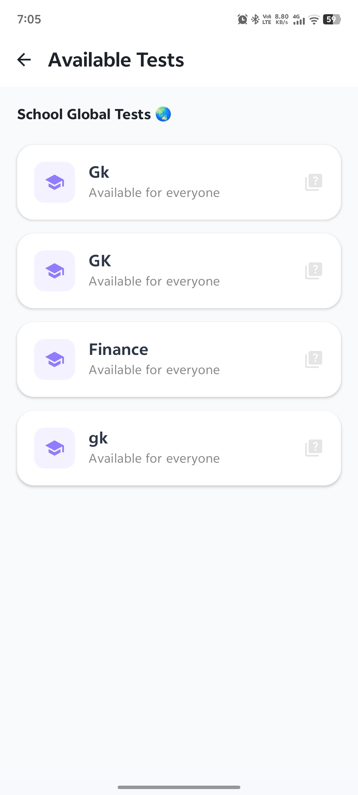 |

| Quiz Interface (Submitting) | Student Leaderboard | Student Leave Apply |
|:---:|:---:|:---:|
| 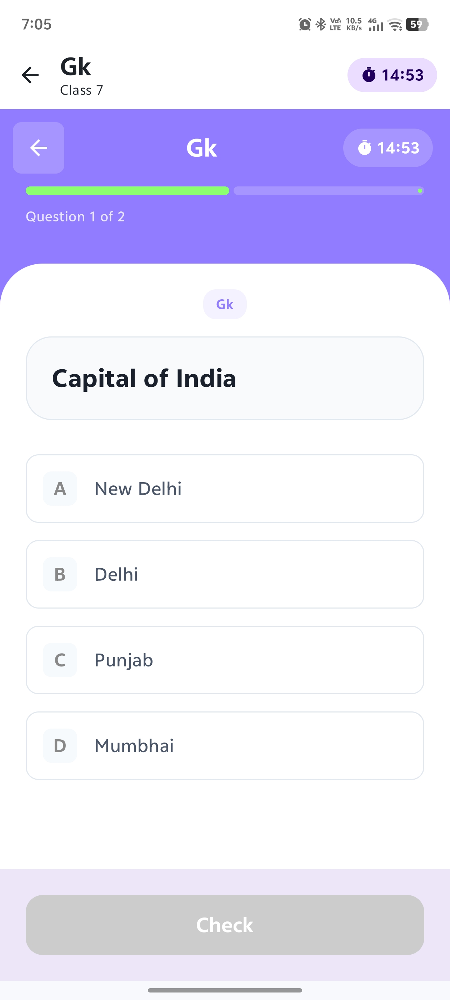 | 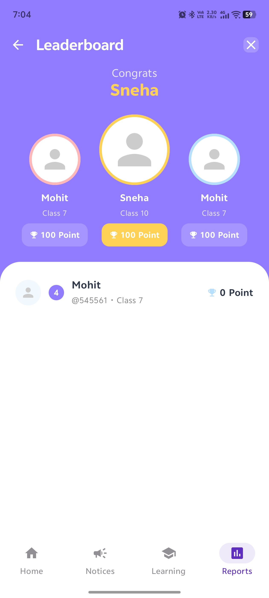 | 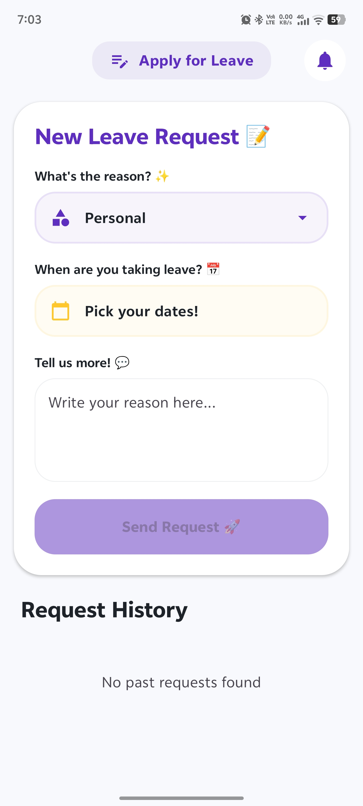 |

### 🌐 Settings & Dynamic Localization
| Localization Settings Screen | UI Translated to Telugu |
|:---:|:---:|
| 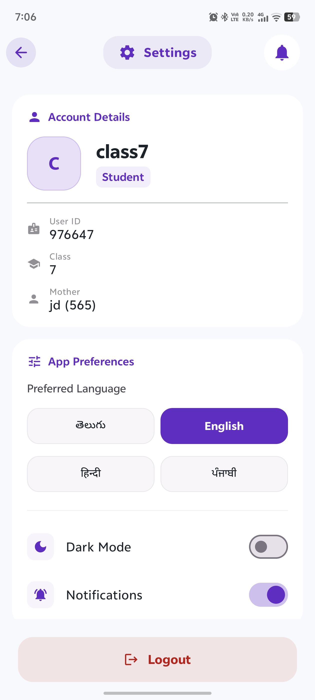 | 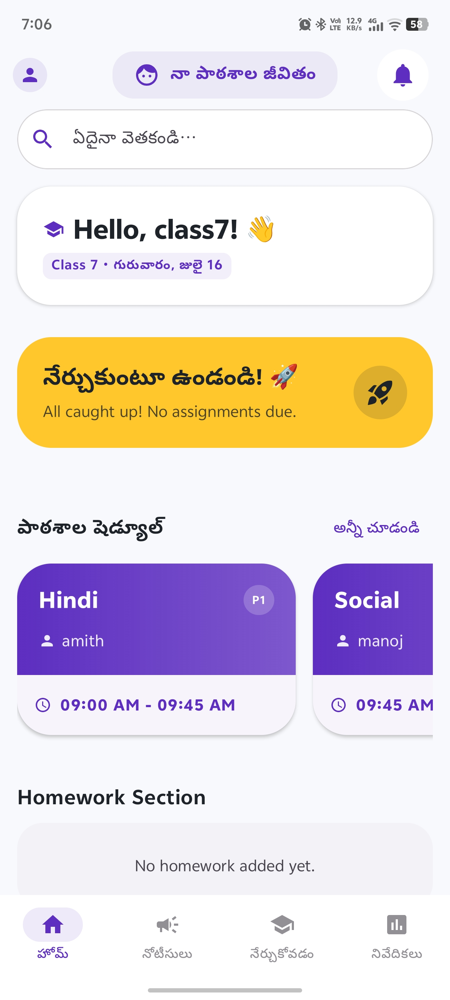 |

---

## 🎨 Personalization & UX
* **Dynamic Dark/Light Mode**: Full customization via the settings panel, applied instantly at startup using the `SharedPreferences` database hook in `MarkMyDayApp`.
* **Splash Screen API**: Clean entrance animation using Android's native splash utility.

---

## 👥 App Creators
* **[Yash](https://github.com/yashreddy1154)** — Android Developer
* **[Tarak](https://github.com/Tarakreddy011)** — Android Developer
* **[Teja Reddy](https://github.com/TejaReddyKuru)** — Android Developer
